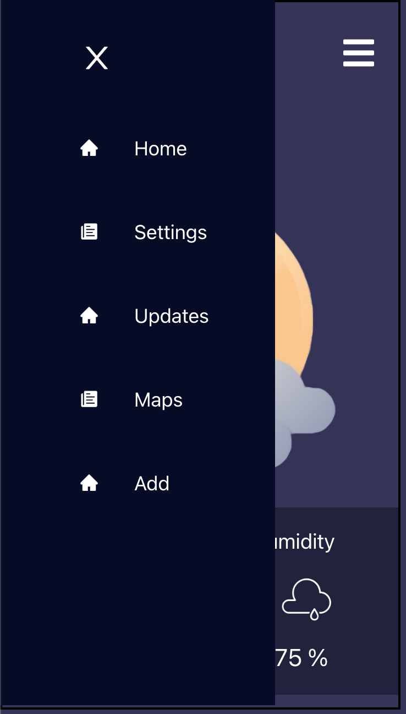

<!-- Please update value in the {}  -->

<h1 align="center">Weather App</h1>

<!-- 

   Solution for a challenge from  <a href="http://devchallenges.io" target="_blank">Devchallenges.io</a>.

 -->

<!-- TABLE OF CONTENTS -->

## Table of Contents

- [Overview](#overview)
- [Built With](#built-with)
- [Features](#features)
- [Contact](#contact)
- [Acknowledgements](#acknowledgements)

<!-- OVERVIEW -->

## Overview

 
<h1 align="center">Homepage (moblie view)</h1>

 
 
<h1 align="center">Sidebar</h1>

 

### What have i learned/improved? 

- Creating projects/ using Git in a team context
- Breaking down Designs
- Working with API's in ReactJS
- Communications skills

 

## Built With

<!-- This section should list any major frameworks that you built your project using. Here are a few examples.-->

- ReactJS

 

## Features (From Me)

<!-- List the features of your application or follow the template. Don't share the figma file here :) -->

- Live Weather Data from API
- SideBar

 

## Acknowledgements

<!-- This section should list any articles or add-ons/plugins that helps you to complete the project. This is optional but it will help you in the future. For exmpale -->

- [Open-weather API](https://openweathermap.org)

 

## Contact

<!-- - Website [your-website.com](https://{your-web-site-link}) -->

- GitHub [@favour33](https://github.com/favour33)
- linkedin [@Favour Nwachukwu](https://www.linkedin.com/in/fn84/})
